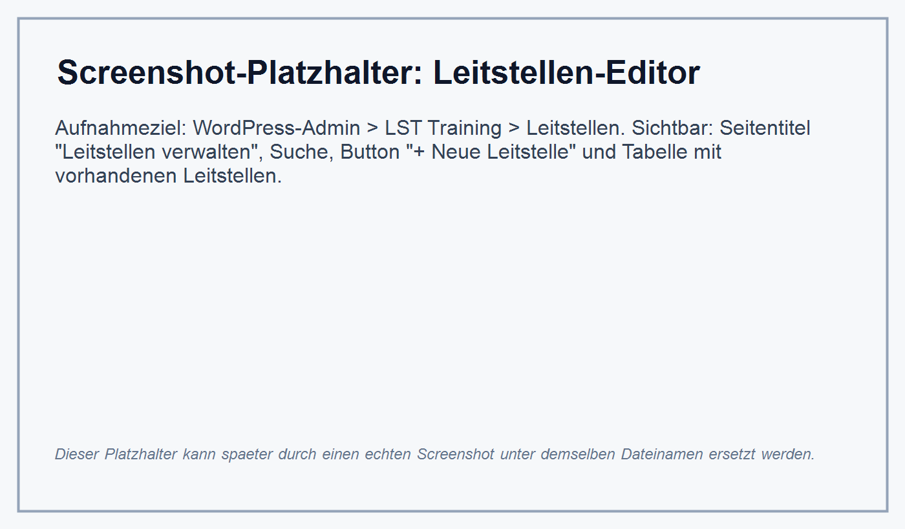
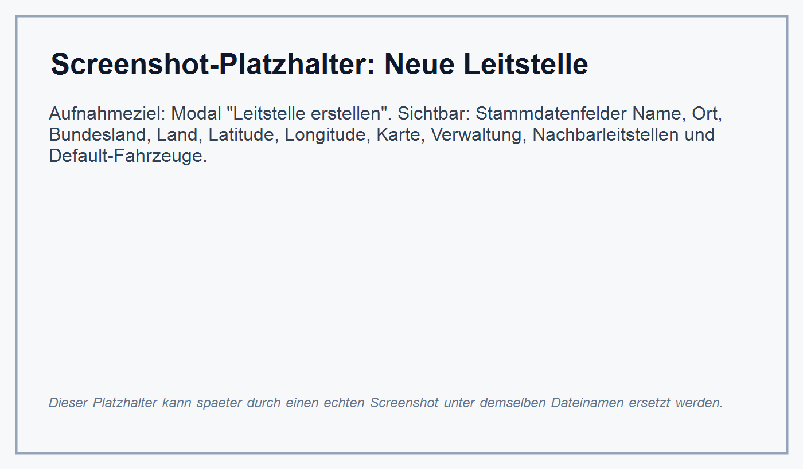
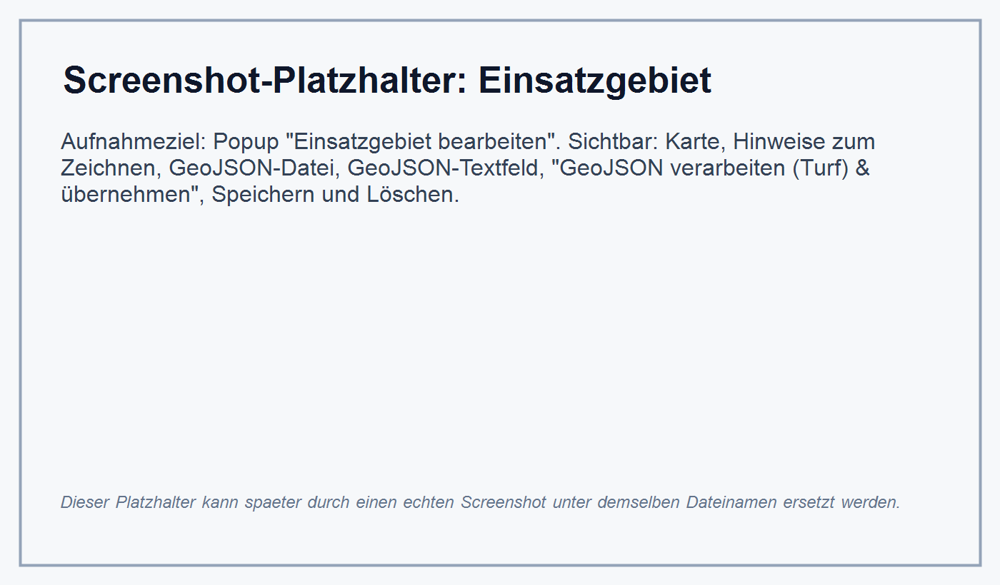
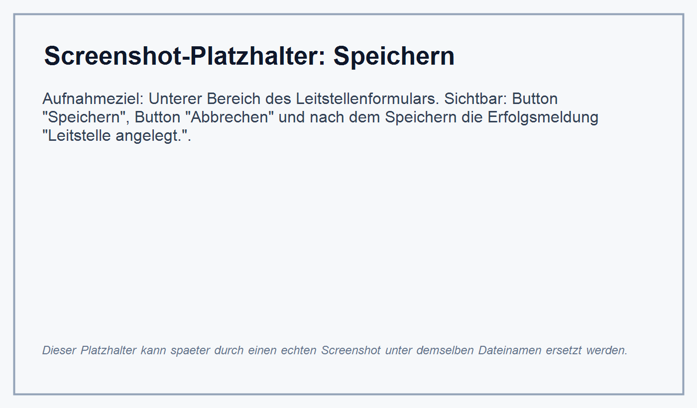
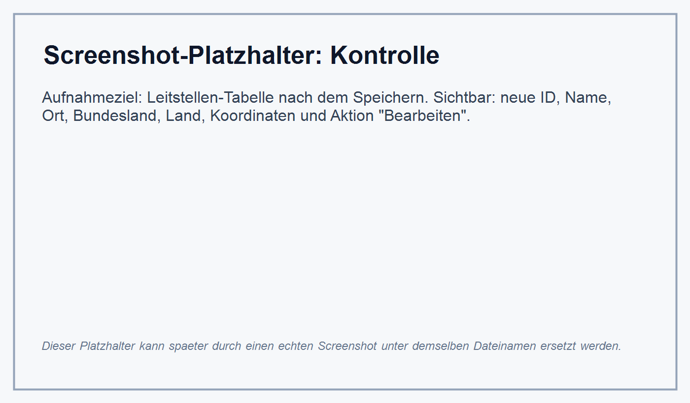

# Eigene Leitstelle anlegen

Diese Anleitung beschreibt den aktuell im Code vorhandenen Ablauf zum Anlegen einer Leitstelle im WordPress-Adminbereich von LST Training. Sie richtet sich an Anwender ohne Programmierkenntnisse.

Die Screenshots in dieser Datei sind Platzhalter. Sie beschreiben genau, welche Ansicht später als echter Screenshot eingefügt werden soll.

## Voraussetzungen

### Welche Rechte werden benötigt?

Du musst in WordPress angemeldet sein.

Für den Menüpunkt **LST Training -> Leitstellen** brauchst du eines dieser Rechte:

- WordPress-Administratorrechte. Administratoren dürfen laut Code immer alle LST-Training-Bereiche bearbeiten.
- Eine LST-Training-Berechtigung für den Bereich **Leitstellen**. Diese Rechte werden im Plugin über **LST Training -> Benutzer** gepflegt.

Für die späteren Arbeitsschritte können zusätzliche Rechte nötig sein:

- **Wachen** für das Bearbeiten oder Zuordnen von Wachen
- **Krankenhäuser** für das Bearbeiten oder Zuordnen von Krankenhäusern
- **Fahrzeuge** für das Bearbeiten von Fahrzeugen

### Welche Daten sollten vorliegen?

Lege dir vor dem Anlegen möglichst diese Daten bereit:

- Name der Leitstelle
- Ort
- Bundesland
- Land
- Koordinaten des Leitstellenstandorts als Latitude und Longitude
- Einsatzgebiet als GeoJSON-Datei oder GeoJSON-Text, falls du das Gebiet importieren möchtest
- Optional: eine Liste angrenzender Nebenleitstellen, sofern diese bereits angelegt sind
- Optional: Bildpfad oder URL für das Polizei-Standardfahrzeug
- Optional: Bildpfad oder URL für das Rettungsdienst-Standardfahrzeug

Der Name ist im Formular als Pflichtfeld markiert. Die übrigen Stammdatenfelder sind im aktuellen Formular vorhanden, aber nicht als Pflichtfelder gekennzeichnet.

## Leitstellen-Editor Öffnen

1. Öffne den WordPress-Adminbereich.
2. Klicke links im Menü auf **LST Training**.
3. Öffne den Unterpunkt **Leitstellen**.

Die Seite heißt **Leitstellen verwalten**. Dort siehst du eine Suche, den Button **+ Neue Leitstelle** und eine Tabelle vorhandener Leitstellen mit den Spalten **ID**, **Name**, **Ort**, **Bundesland**, **Land**, **Koordinaten** und **Aktionen**.

## Neue Leitstelle Anlegen

1. Klicke auf **+ Neue Leitstelle**.
2. Es öffnet sich das Formular **Leitstelle erstellen**.
3. Fülle die Stammdaten aus.

Vorhandene Stammdatenfelder:

- **Name**: Name der Leitstelle, Pflichtfeld.
- **Ort**: Ort der Leitstelle.
- **Bundesland**: Bundesland der Leitstelle.
- **Land**: Land der Leitstelle.
- **Latitude**: Breitengrad des Leitstellenstandorts.
- **Longitude**: Längengrad des Leitstellenstandorts.

Neben den Eingabefeldern gibt es eine Karte. Der rote Marker zeigt den Standort der Leitstelle. Wenn du den Marker verschiebst, werden Latitude und Longitude aktualisiert.

Weitere vorhandene Bereiche im Formular:

- **Einrichtung** als Ablauf mit Stammdaten, Einsatzgebiet, Ressourcen sowie Versorgung & Orte.
- **Nachbarleitstellen bearbeiten** als eigener Button. Die große Auswahl und Karte öffnen in einem separaten Overlay.
- **Default-Fahrzeuge** mit Polizei-Fahrzeugbild, Default-Rettungsfahrzeug und Buttons zum Auswählen eines Bildes sowie zum Bearbeiten von Blaulichtern.

## Einsatzgebiet Festlegen

Das Einsatzgebiet wird über den Button **Einsatzgebiet bearbeiten** im Bereich **Einrichtung** geöffnet.

Im aktuellen Code sind zwei Wege vorhanden:

- Gebiet direkt in der Karte zeichnen
- GeoJSON importieren, entweder als Datei oder über ein Textfeld

### Gebiet Zeichnen

1. Klicke auf **Einsatzgebiet bearbeiten**.
2. Im Popup **Einsatzgebiet bearbeiten** fügt ein Linksklick in die Karte einen Punkt zum Polygon hinzu.
3. Ein Rechtsklick entfernt den letzten Punkt oder löscht das Polygon.
4. Schließe das Polygon, wenn das Gebiet vollständig ist.

### GeoJSON Importieren

1. Klicke auf **Einsatzgebiet bearbeiten**.
2. Nutze entweder **GeoJSON-Datei** oder **Oder GeoJSON einfügen**.
3. Verwende nicht beide Importquellen gleichzeitig.
4. Klicke auf **GeoJSON verarbeiten (Turf) & übernehmen**.
5. Das importierte Gebiet wird vereinfacht, zusammengeführt und in die Karte übernommen.

Wichtig beim Neuanlegen: Das Popup enthält zwar einen Button **Speichern**, dieser direkte Popup-Speicherweg erwartet aber eine bereits gespeicherte Leitstellen-ID. Wenn du gerade eine neue Leitstelle erstellst, übernimm oder zeichne das Gebiet im Popup und speichere anschließend das Hauptformular **Leitstelle erstellen**. Nach dem ersten Speichern hat die Leitstelle eine ID.

## Leitstelle Speichern

1. Prüfe die Stammdaten.
2. Prüfe, ob Latitude und Longitude gesetzt sind, falls der Standort benötigt wird.
3. Falls du ein Einsatzgebiet im Popup gezeichnet oder übernommen hast, schließe das Popup.
4. Klicke unten im Leitstellenformular auf **Speichern**.

Nach erfolgreichem Anlegen zeigt WordPress eine Meldung **Leitstelle angelegt.** an. Beim späteren Bearbeiten lautet die Meldung **Leitstelle gespeichert.**.

## Kontrolle

Du erkennst eine erfolgreich angelegte Leitstelle an diesen Punkten:

- Oben erscheint die Erfolgsmeldung **Leitstelle angelegt.**.
- Die Leitstelle steht in der Tabelle **Leitstellen verwalten**.
- Die Tabelle zeigt eine neue ID.
- Die Spalten Name, Ort, Bundesland, Land und Koordinaten zeigen die gespeicherten Werte.
- Über **Bearbeiten** kannst du die Leitstelle wieder öffnen.

Wenn nach dem Speichern die Folgeaktionen weiterhin deaktiviert bleiben, prüfe, ob ein gültiges GeoJSON vorhanden ist. Wachen, Nachbarleitstellen, Krankenhäuser, POIs und OSM-Sync werden erst aktiv, wenn die Leitstelle gespeichert ist und ein Einsatzgebiet besitzt.

## Nächste Schritte

Nach dem Anlegen der Leitstelle kannst du die weiteren Daten ergänzen.

### Wachen Zuordnen

Im Leitstellenformular gibt es im Bereich **Einrichtung** den Schritt **Ressourcen**:

- **Wachen bearbeiten** öffnet die Wachen-Verwaltung für die aktuelle Leitstelle.
- **Wachen im Einsatzgebiet zuordnen** öffnet die automatische Zuordnung für Wachen im hinterlegten Einsatzgebiet.
- **Nachbarleitstellen bearbeiten** öffnet ein Overlay mit Mehrfachauswahl und Karte für angrenzende Leitstellen. Die Auswahl wird mit dem Hauptformular gespeichert.

### Krankenhäuser Zuordnen

Im Schritt **Versorgung & Orte** gibt es den Button **Krankenhäuser bearbeiten**. Das zugehörige Popup zeigt eine Karte, einen Filter und eine Liste von Krankenhäusern mit Checkboxen. Dort können Krankenhäuser der Leitstelle zugeordnet und gespeichert werden.

### Fahrzeuge Zuordnen

Fahrzeuge werden über den Admin-Unterpunkt **LST Training -> Fahrzeuge** verwaltet, sofern du die entsprechende Berechtigung hast. Im Leitstellenformular selbst gibt es zusätzlich den Bereich **Default-Fahrzeuge** für Standardbilder und Blaulichter.

### Simulation Starten

Die Simulation wird nicht über die Leitstellen-Adminseite gestartet. Im vorhandenen Code gibt es dafür den Frontend-Shortcode **[lsttraining_start]**. Auf einer WordPress-Seite mit diesem Shortcode erscheint die Oberfläche **Simulation starten**. Dort muss eine Leitstelle ausgewählt werden; danach startet der Button **Simulation starten** eine neue Spielinstanz.

Vor dem Start sollten mindestens eine Leitstelle, passende Wachen und Fahrzeuge vorhanden sein, damit in der Simulation nutzbare Ressourcen verfügbar sind.

## Hinweise Zum Aktuellen Stand

- Echte Screenshots wurden in dieser Umgebung nicht erstellt; die Dateien unter `docs/screenshots/` sind beschriftete Platzhalter.
- Der Code zeigt keine automatische Geokodierung für Ort, Bundesland oder Land. Koordinaten müssen im Formular gesetzt oder über den Kartenmarker gepflegt werden.
- Der direkte **Speichern**-Button im Einsatzgebiet-Popup benötigt eine vorhandene Leitstellen-ID. Beim Neuanlegen sollte das Hauptformular gespeichert werden.
- Die Anleitung beschreibt nur die im Code vorhandenen Admin- und Frontend-Elemente.
